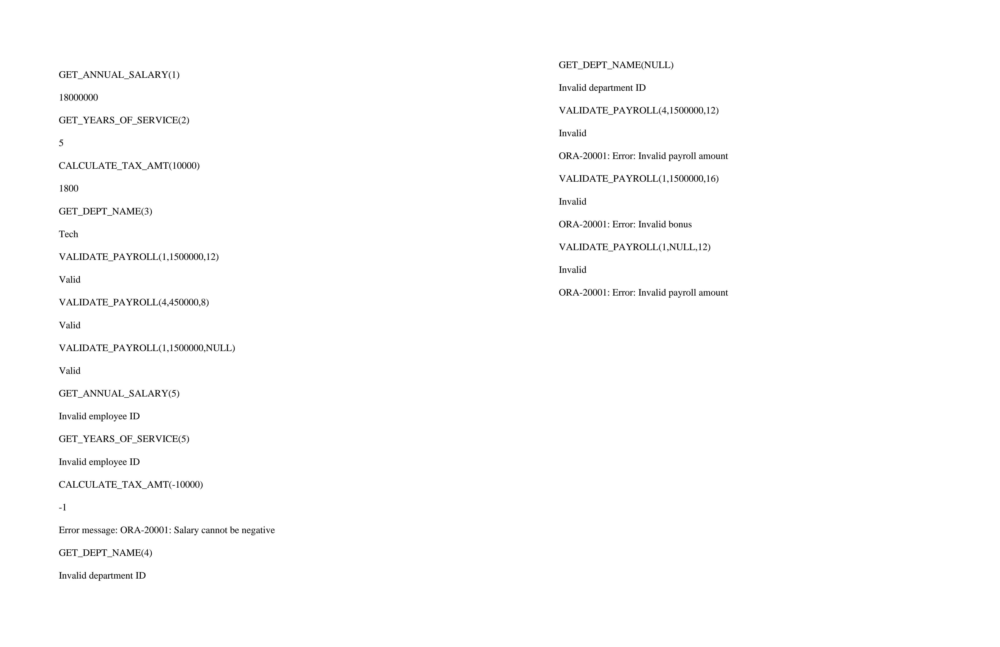

# GOTO Statements and Functions in PL/SQL
**Scope:** This practical assignment covers GOTO statements, functions, and error handling.

## GOTO Statements
GOTO statements cause execution to jump to a labeled section in your PL/SQL block.

### 1. Number Classifier
```sql
-- classify number as even or odd
DECLARE
    num INTEGER := 10; 
BEGIN
    IF MOD(num, 2) = 0 THEN
        GOTO even;
    END IF;
    
    DBMS_OUTPUT.PUT_LINE(num || ' is odd');
    GOTO end_block;
    
    <<even>>
    DBMS_OUTPUT.PUT_LINE(num || ' is even');
    
    <<end_block>>
    NULL; -- do nothing
END;
/
```

### 2. Salary Review
```sql
-- calculate manager employee raise based on the total number of hours worked on project(s)
-- 1hour -> 1% increase
DECLARE
    hours_worked NUMBER;
    current_salary NUMBER;
    updated_salary NUMBER;
BEGIN
    -- get current salary of manager
    SELECT monthly_salary 
    INTO current_salary
    FROM employee
    WHERE role = 'Manager';

    -- get total hours worked on project
    SELECT sum(no_hours)
    INTO hours_worked
    FROM emp_proj
    WHERE emp_id = (
        SELECT emp_id FROM employee WHERE role = 'Manager'
    ); 

    GOTO raise_salary;

    <<raise_salary>>
        updated_salary := current_salary * (1+(hours_worked/100));
        DBMS_OUTPUT.PUT_LINE('Updated manager salary: ' || updated_salary);
      
EXCEPTION
    WHEN NO_DATA_FOUND THEN
        DBMS_OUTPUT.PUT_LINE('Could not retrieve data from database');
    WHEN TOO_MANY_ROWS THEN
        DBMS_OUTPUT.PUT_LINE('Expected only one manager');
END;
/
```

### 3. Illegal GOTO and Fix
```sql
-- demonstrate illegal goto
DECLARE
    num INTEGER := -1;
    is_negative EXCEPTION;
BEGIN
    IF num < 0 THEN
        raise is_negative;
    END IF;
    GOTO end_program;

    <<error_label>>
    DBMS_OUTPUT.PUT_LINE('Number cannot be negative');

    <<end_program>>
        NULL;
EXCEPTION
    WHEN is_negative THEN
        GOTO error_label;

END;
/

-- fix: remove unnecessary goto error_label
DECLARE
    num INTEGER := -1;
    is_negative EXCEPTION;
BEGIN
    IF num < 0 THEN
        raise is_negative;
    END IF;

EXCEPTION
    WHEN is_negative THEN
        DBMS_OUTPUT.PUT_LINE('Number cannot be negative');

END;
/
```

### 4. Rewrite Without GOTO
```sql
-- let's rewrite number classifier without goto statements

DECLARE
    num INTEGER := 10; 
BEGIN
    IF MOD(num, 2) = 0 THEN
        DBMS_OUTPUT.PUT_LINE(num || ' is even');
    ELSE
        DBMS_OUTPUT.PUT_LINE(num || ' is odd');
    END IF;

END;
/
```

## Functions
Functions are reusable subprograms that perform an operation and return a single value.

### 1. Annual Salary
```sql
-- calculate annual salary for a given employee

CREATE FUNCTION get_annual_salary(i_emp_id INTEGER) RETURN NUMBER AS
    annual_salary NUMBER;
BEGIN
    SELECT monthly_salary*12
    INTO annual_salary
    FROM employee
    WHERE emp_id = i_emp_id;
    RETURN annual_salary;
EXCEPTION
    WHEN NO_DATA_FOUND THEN
        DBMS_OUTPUT.PUT_LINE('Invalid employee ID');
        RETURN NULL;
END;
/
```

### 2. Years of Service
```sql
-- get years of service for a employee

CREATE FUNCTION get_years_of_service(i_emp_id IN INTEGER) RETURN INTEGER AS 
start_date DATE;
years INTEGER;
BEGIN
    -- get date
    SELECT join_date INTO start_date
    FROM employee WHERE emp_id = i_emp_id;
    -- calculate years
    years := TRUNC(MONTHS_BETWEEN(sysdate, start_date) / 12);
    RETURN years;

EXCEPTION
    WHEN NO_DATA_FOUND THEN
        DBMS_OUTPUT.PUT_LINE('Invalid employee ID');
        RETURN NULL;
END;
/
```

### 3. Tax Calculator
```sql
-- calculate tax amount based on given salary and fixed tax_rate
CREATE FUNCTION calculate_tax_amt(salary NUMBER) RETURN NUMBER AS
tax_rate CONSTANT INTEGER DEFAULT 18;
BEGIN
    IF salary < 0 THEN
        RAISE_APPLICATION_ERROR(-20001, 'Salary cannot be negative');
    END IF;
    RETURN salary * (tax_rate/100);
EXCEPTION 
    WHEN OTHERS THEN
        DBMS_OUTPUT.PUT_LINE('Error message: ' || SQLERRM);
        RETURN -1;
END;
/
```

### 4. Department Name
```sql
-- retrieve department name given the dept id
CREATE FUNCTION get_dept_name(i_dept_id IN INTEGER) RETURN VARCHAR2 AS
d_name VARCHAR2(50);
BEGIN
    SELECT dept_name INTO d_name FROM department WHERE dept_id = i_dept_id;
    RETURN d_name;
EXCEPTION 
    WHEN NO_DATA_FOUND THEN
        DBMS_OUTPUT.PUT_LINE('Invalid department ID');
        RETURN NULL;
END;
/
```
### 5. Validate Payroll
```sql
-- validate payroll for particular employee

CREATE FUNCTION validate_payroll(i_emp_id INTEGER, amount NUMBER, bonus NUMBER) RETURN VARCHAR2 AS
emp_salary NUMBER;
BEGIN
    -- get employee's salary
    SELECT monthly_salary INTO emp_salary FROM employee WHERE emp_id = i_emp_id;

    -- validate payroll amount
    IF amount IS NULL OR amount <= 0 OR emp_salary != amount THEN
         RAISE_APPLICATION_ERROR(-20001, 'Error: Invalid payroll amount');
    END IF;

    -- validate bonus 0-15%
    IF bonus < 0 OR bonus > 15 THEN
        RAISE_APPLICATION_ERROR(-20001, 'Error: Invalid bonus');
    END IF;

    -- no errors, so payroll data is valid
    RETURN 'Valid';
    
EXCEPTION 
    WHEN NO_DATA_FOUND THEN
        DBMS_OUTPUT.PUT_LINE('Invalid employee ID');
        RETURN 'Invalid';
    WHEN OTHERS THEN
        DBMS_OUTPUT.PUT_LINE(SQLERRM);
        RETURN 'Invalid';

END;
/
```

## Testing Functions
```sql
-- use select statements to test all functions

-- correct usage
SELECT get_annual_salary(1) FROM dual;
SELECT get_years_of_service(2) FROM dual;
SELECT calculate_tax_amt(10000) FROM dual;
SELECT get_dept_name(3) FROM dual;
SELECT validate_payroll(1, 1500000, 12) FROM dual;
SELECT validate_payroll(4, 450000, 8) FROM dual;
SELECT validate_payroll(1, 1500000, NULL) FROM dual;

-- incorrect usage
-- invalid emp_id returns NULL
SELECT get_annual_salary(5) FROM dual;
SELECT get_years_of_service(5) FROM dual;

-- Negative salary
SELECT calculate_tax_amt(-10000) FROM dual;

-- invalid dept_id
SELECT get_dept_name(4) FROM dual;
SELECT get_dept_name(NULL) FROM dual;

-- invalid payroll data
SELECT validate_payroll(4, 1500000, 12) FROM dual;
SELECT validate_payroll(1, 1500000, 16) FROM dual;
SELECT validate_payroll(1, NULL, 12) FROM dual;
```

**Output**


## NOTES
I acknowledge using Claude AI to generate random employee table data.
